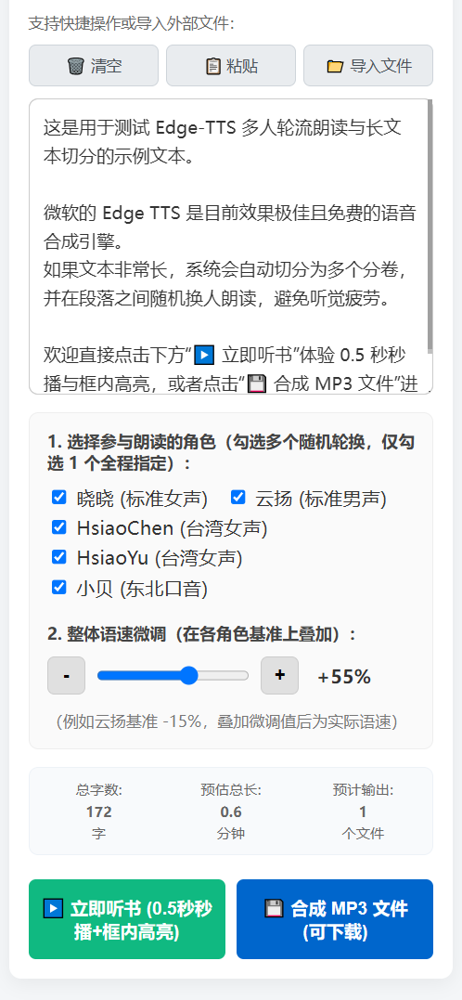

# edge-tts-webui
长文章与小说听书工具：粘贴文本即刻朗读并带逐句高亮，支持多主播交替朗读防听觉疲劳，可一键导出 MP3 供骑行与通勤离线听。演示地址 https://tts.818525.xyz:50443/

# 长文本朗读与听书工具

这是一个简单易用的网页听书与文本转语音工具。把你平时想看的文章、新闻、小说粘贴进来，就可以像听播客一样直接听，或者导出成 MP3 放到手机和随身听里离线听。

直接调用微软 Edge 在线神经网络语音服务。**无需安装 Microsoft Edge 浏览器，无需 Windows 系统，也无需申请复杂的 API Key 密钥**。

---
## 界面预览

| 桌面端界面 | 移动端界面 |
| :---: | :---: |
|  |  |

## 它能帮你干什么？

### 1. 在线听文章 / 读书（带字幕高亮）
- **即粘即听**：粘贴几万字的长文章或小说，点击就能直接播放，不用花时间等待文件合成。
- **自动跟随高亮**：朗读到哪一句，文本框里的字就会跟着高亮显示，并自动向下滚动，方便边听边看、防止听漏。

### 2. 导出 MP3 文件（骑行 / 通勤 / 健身离线听）
- **自动分卷保存**：如果是超长的小说，系统会自动切分为“第 1 卷”、“第 2 卷”等多个 MP3 文件，方便管理。
- **随身听放口袋**：下载 MP3 到手机、蓝牙耳机或随身听里，骑行、跑步或上下班路上随时听。

### 3. 换主播轮流朗读（长时间听书不犯困）
- **多人交替朗读**：同一个声音听超过 10 分钟极其容易困倦。系统支持勾选多个主播（标准女声、沉稳男声、东北口音、台湾口音等），不同段落自动换人朗读，听半小时依然有新鲜感。
- **声音自动校准**：不同主播的声音大小和快慢已在后台经过调校，换人时不会忽大忽小或忽快忽慢。

---

## 常用小功能

- **快捷操作**：支持一键清空、剪贴板一键粘贴，以及直接导入 `.txt` / `.md` 文本文件。
- **语速微调**：提供 `+` / `-` 微调按钮，方便随时调快或调慢朗读速度。
- **记住偏好**：刷新页面或下次打开，你选好的主播和习惯的语速依然保留。
- **手机电脑通用**：自适应手机屏幕，手机浏览器打开也能舒适操作。

---

## 如何运行

### 1. 安装依赖

需要 Python 3.8 或以上版本：

```bash
pip install fastapi uvicorn edge-tts gunicorn
```

### 2. 启动服务

打开终端运行以下命令：

```bash
uvicorn app:app --host 0.0.0.0 --port 8000 --reload
```

在浏览器打开 `http://127.0.0.1:8000` 即可开始使用。


### 3. 部署容器
```
chmod +x init.sh 
docker run -itd --name edge_tts --hostname edge_tts  -p 8000:80 -v /etc/localtime:/etc/localtime:ro -v /home/edge_tts:/datav python:3.11-alpine3.20 /datav/init.sh
在浏览器打开 http://127.0.0.1:8000 即可开始使用。
```
---

> 说明：本项目全部代码均由 Gemini Flash 3.6 生成。

## 📄 协议

MIT License
```
